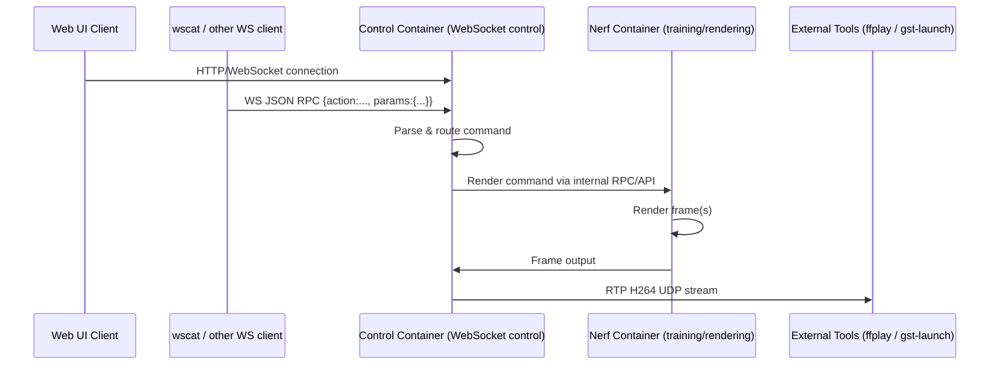

```mermaid 
sequenceDiagram
    participant UserUI as Web UI Client
    participant WSClient as wscat / other WS client
    participant Control as Control Container (WebSocket control)
    participant Nerf as Nerf Container (training/rendering)
    participant Tools as External Tools (ffplay / gst-launch)

    UserUI->>Control: HTTP/WebSocket connection
    WSClient->>Control: WS JSON RPC {action:..., params:{...}}
    Control->>Control: Parse & route command
    Control->>Nerf: Render command via internal RPC/API
    Nerf->>Nerf: Render frame(s)
    Nerf->>Control: Frame output
    Control->>Tools: RTP H264 UDP stream
```
